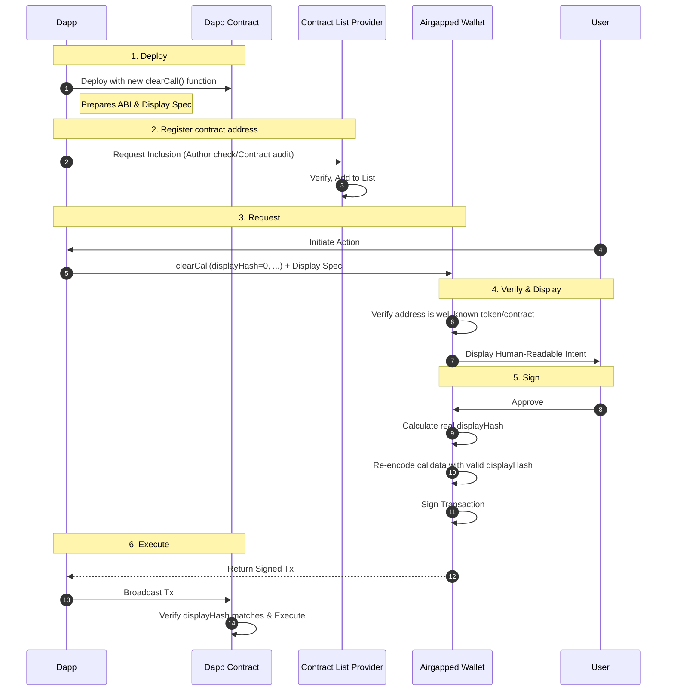

# Clear Signing Architecture

## Abstract

This document defines an architecture for transaction authorization in human-readable form, known as **Clear Signing**.
It aims to eliminate blind signing by establishing a trustless bridge between a user's wallet and smart contract. The
architecture consists of a social layer for contract identity verification and a technical layer for declarative display
and verification of transaction metadata. By combining these, wallets can provide users with clear, authenticated
context before they commit to a transaction.

## Table of Contents

- [1. State of the Art Review](#1-state-of-the-art-review)
- [2. Architecture Overview](#2-architecture-overview)
- [3. Address Verification](#3-address-verification)
- [4. Display Format Specification](#4-display-format-specification)
- [5. Contract-Side Display Verification](#5-contract-side-display-verification)
- [6. Stateless Wallet Requests](#6-stateless-wallet-requests)
- [7. Interaction Flow](#7-interaction-flow)
- [8. Limitations](#8-limitations)
- [9. Roadmap](#9-roadmap)
- [10. Conclusion](#10-conclusion)

## 1. State of the Art Review

Before introducing the Clear Signing architecture, it is essential to understand the current landscape. The emerging
landscape for clear signing often drifts toward dependence on trust in exchange for convenience. To address this
trade-off, this architecture evaluates solutions against the *
*[Trustless Manifesto](https://trustlessness.eth.limo/general/2025/11/11/the-trustless-manifesto.html)**. We treat clear
signing not as a UX feature, but as a critical verification layer.

### 1.1 Evaluation Criteria

* **Phishing Protection**: The system MUST authenticate contract identity to prevent impersonation. Legitimacy SHOULD be
  derived from math or transparent social consensus, not opaque whitelists.
* **Local Interpretation**: The system MUST translate technical details (hex blobs, raw magnitudes) into semantic user
  intent locally. Interpretation and verification MUST be performed without reliance on live connections or "active"
  intermediaries, ensuring full functionality on air-gapped, cold storage devices.
* **Verifiability**: The system MUST cryptographically guarantee that the visual prompt accurately represents the
  on-chain execution.
* **Censorship Resistance**: The system MUST operate without gatekeepers. No central registry or service provider SHOULD
  possess the capability to selectively withhold metadata or "blind" users to specific contracts.
* **Trust Model**: The fundamental basis of security for the solution (e.g., social consensus, cryptography,
  reputation).

### 1.2 Off-Chain Metadata Registries (ERC-7730)

**ERC-7730** is a standard for off-chain JSON metadata that defines how wallets should format and display smart contract
interactions.

- **Phishing Protection**: Links addresses to identities but relies on central registry curation. This curation
  bottleneck hinders adoption across diverse dApps and chains.
- **Local Interpretation**: Metadata is parsed locally mapping calldata to semantic formats. Since the specification is
  defined per contract and not provided with the method call, air-gapped wallets must embed the entire registry or fetch
  it from a remote source to ensure availability.
- **Verifiability**: Since the display specification is defined off-chain, there is no cryptographic mechanism to verify
  that the displayed intent matches the on-chain execution.
- **Censorship Resistance**: Wallets rely on centralized repositories, making them susceptible to gatekeeping.
- **Trust Model**: Delegated trust (Registry Maintainers).

### 1.3 NatSpec and Source Verification

**NatSpec** (Natural Language Specification) is embedded in source code and published to IPFS/Sourcify. Wallets verify
the metadata hash against on-chain bytecode. Historically, it has received low adoption because developers typically
publish raw ABIs without adding the necessary documentation tags.

- **Phishing Protection**: None.
- **Local Interpretation**: Relies on developer-written `@notice` tags on functions. Requires on-chain hash retrieval
  and IPFS fetch.
- **Verifiability**: Cryptographic link between source and bytecode.
- **Censorship Resistance**: High (Content-addressed).
- **Trust Model**: Cryptographic binding.

### 1.4 On-Chain Description Standards

Contracts implement logic to return their own descriptions (e.g., **ERC-719**, **EIP-4430**, **EIP-6384**).

- **Phishing Protection**: None
- **Local Interpretation**: No, it requires on-chain calls to retrieve descriptions defined in smart contracts. The
  contract itself acts as the interpreter by consuming calldata and returning a text description.
- **Verifiability**: The description is generated by the contract's own on-chain logic.
- **Censorship Resistance**: Permissionless.
- **Trust Model**: On-chain logic. Requires RPC calls to retrieve descriptions.

### 1.5 Typed Structured Data

Standards like **EIP-712** and **SNIP-12** (Starknet) provide a framework for signing structured messages which are
interpreted by the smart contract.

- **Phishing Protection**: None. The standard verifies the *WHAT* (data structure) but not the *WHO* (contract
  identity).
- **Local Interpretation**: **SNIP-12** supports advanced display types for better formatting, whereas **EIP-712**
  typically shows raw values (e.g., huge integers) which lack semantic meaning. Standardized local parsing ensures the
  wallet can display the structure without external dependencies.
- **Verifiability**: The contract cryptographically verifies the hash signed over the structured data.
- **Censorship Resistance**: Permissionless.
- **Trust Model**: None

### 1.6 dApp-Provided Metadata

DApps can suggest metadata directly to wallets via RPC (e.g., **Rich Site-Proposed Metadata**, **EIP-7896**).

- **Phishing Protection**: Relies on **Trust on First Use (TOFU)**. The wallet implicitly trusts the dApp interface to
  truthfully identify the contract it is interacting with.
- **Local Interpretation**: DApps provides raw ABI specifications, restricting the display to technical function names
  and parameters without rich, human-readable descriptions. Interpretation is strictly local.
- **Verifiability**: There is no binding between the display and the transaction data. The contract only verifies the *
  *function abi**; there is no mechanism to verify that the provided parameter names or descriptions match the actual
  logic being executed.
- **Censorship Resistance**: Direct RPC delivery eliminates third-party gatekeepers.
- **Trust Model**: **Trust on First Use (TOFU)**.

### 1.7 Transaction Simulation

Sandboxed execution allows users to see balance changes before signing (e.g., via **Blockaid** or **eth_simulatev1**).

- **Phishing Protection**: Relies on the provider's proprietary database of known/malicious contracts.
- **Local Interpretation**: Shows predicted balance changes. Simulation depends on a provider's sandbox environment,
  making offline verification impossible. Reliance on centralized providers creates **indispensable intermediaries** and
  a privacy-invasive surveillance infrastructure.
- **Verifiability**: Simulation provides a *prediction* of the outcome, not a cryptographic guarantee. Actual execution
  can diverge from simulation due to **State Divergence** (moving target state), **"Red Pill" Attacks** (sandbox
  detection), **Simulation Spoofing** (time-gap exploitation), and **Bytecode Changes** (logic updates in upgradeable
  contracts).
- **Censorship Resistance**: Providers can selectively block or "fail" simulations for specific contracts.
- **Trust Model**: Probabilistic safety; delegation of verification to a SaaS provider.

### 1.8 Intent-Based Architectures

Declaring *outcomes* ("swap A for B") instead of *paths* (e.g., **ERC-7521**, **CoW Protocol**). These operate via
application-level logic, restricting compatibility largely to standardized assets (e.g., tokens) and offering limited
support for complex, generic contract interactions without platform-specific redesigns.

- **Phishing Protection**: Users verify their intent (the token they want), abstracting away the specific pool/contract
  address.
- **Local Interpretation**: The lack of a display specification often makes intent signatures not user-friendly, as
  wallets default to displaying raw hex data structures instead of the semantic intent.
- **Verifiability**: The mechanism creates a perfect binding: the signed message *is* the condition for execution. If
  the user's intent (e.g., "Receive 100 USDC") cannot be met, the transaction cannot happen.
- **Censorship Resistance**: Theoretically anyone can fill the intent.
- **Trust Model**: Intent Outcome Binding.

### 1.9 Summary Evaluation Table

The following table synthesizes the Clear Signing solutions against the trustless evaluation criteria.

| Solution          | Phishing | Local Inter. | Verifiability | Censorship | Trust Model |
|:------------------|:---------|:-------------|:--------------|:-----------|:------------|
| **ERC-7730**      | Moderate | Strong       | Low           | Low        | Social      |
| **NatSpec**       | None     | Moderate     | High          | High       | Crypto      |
| **dApp RPC**      | Moderate | Low          | Low           | High       | TOFU        |
| **Typed Data**    | None     | Low          | High          | High       | Crypto      |
| **On-Chain Des.** | None     | High         | High          | High       | On-Chain    |
| **Simulation**    | High     | Low          | Low           | Low        | SaaS        |
| **Intents**       | High     | Low          | High          | High       | On-chain    |

## 2. Architecture Overview

Researching the current landscape reveals that attempting to solve both identity and interpretation in a single layer
inevitably leads to compromise. Centralized solutions offer convenience but introduce trusted intermediaries;
decentralized solutions offer integrity but often lack protection from phishing.

By separating the **social** problem of address verification from the **technical** problem of calldata parsing, we
reduce complexity and allow each layer to be optimized independently. This architecture implements this separation
through a two-pronged approach:

1. **Address Verification (Social Layer)**: Delegating the "Who are you?" question to a decentralized system of "
   Contract Lists", verified by community consensus.
2. **Calldata Parsing (Protocol Layer)**: Delegating the "What are you doing?" question to a standardized "Display
   Format", verified by the protocol itself.

This split simplifies the wallet's role: it checks the list for identity and checks the display spec for meaning,
avoiding the need for complex, monolithic verification systems.

### 2.1 Goals

1. **Phishing Protection**
   Users MUST be able to verify the identity of the counterparty before signing. By resolving addresses against
   decentralized **Contract Lists**, wallets MUST be able to distinguish legitimate protocols from malicious lookalikes.
   This is particularly critical for **Token Approvals**, where users MUST ensure they are granting spending capability
   to a verified entity (e.g., the canonical Uniswap Router) rather than an impersonator.

2. **Developer-Driven Interpretation**
   Contract developers are the authoritative source for their interface's semantics. This architecture MUST enable
   developers to define the "Display Interface" alongside the "Binary Interface" (ABI). By cryptographically binding
   this presentation logic to the execution, we establish **"Display is Law"**: the transaction is valid if and only if
   the user approved the specific semantic intent defined by the developer.

3. **Human-Readable Display Format**
   The protocol relies on a standardized, declarative schema to translate raw calldata into user-intelligible terms.
   This format MUST be designed for **efficiency and security**, allowing resource-constrained hardware wallets to parse
   and render complex transactions without the risks associated with executing arbitrary code or relying on external
   display logic.

4. **Self-Contained Transactions**
   Verification MUST be stateless and atomic. All metadata required to decode and verify the transaction MUST be
   embedded within the transaction payload itself. This ensures that **air-gapped cold wallets** can fully interpret the
   user's intent without requiring "live" access to the blockchain state or reliance on centralized indexers.

### 2.2 Non-Goals

While this architecture improves transaction safety, it explicitly does **NOT** address the following:

- **Contract List Delivery**: The mechanism for delivering contract lists to the wallet is OUT OF SCOPE. Wallets are
  free to choose the method that best fits their security model (e.g., HTTPS for hot wallets, firmware embedding for
  cold wallets, decentralized storage for censorship resistance).
- **Legacy Compatibility**: Trustless verification requires the implementation of the Clear Signing contract interface.
  Supporting legacy contracts that cannot be upgraded or wrapped is a NON-GOAL for the *trustless* layer.
- **Execution Path Analysis**: The system relies on verifying the inputs, the target address identity, and the
  immutability of the code. Deconstructing the full execution path (e.g., internal calls between contracts) is NOT
  REQUIRED. Developers define the display interface for their own contracts, but cannot define it for others.
- **Business Logic & Tokenomics**: This standard does NOT verify the economic viability, logic efficiency, or bug-free
  nature of the smart contract. It bridges the gap between the *intended* code (display) and the *actual* code (
  execution), but it does NOT vouch for the quality of that code.

### 2.3 Support for Intent Protocols

Intent-centric protocols (e.g., **ERC-7521**, **Anoma**) represent a paradigm shift from imperative models to
declarative systems. While the specification of such protocols is outside the scope of this architecture, their rise
fundamentally alters the verification problem.

This architecture simplifies the **Address Verification** problem. Instead of verifying the identity of every contract
in a complex execution trace, the user relies on a single, standard **Entry Point** to enforce their constraints. This
contract acts as a trustless gatekeeper, ensuring safety without requiring the user to audit the entire transaction
path.

In this model, users outsource the computational burden of execution to third-party **Solvers**, who compete to find the
optimal path. Consequently, the user does not sign a specific execution trace but rather a set of constraints enforced
by the Entry Point.

Clear Signing is designed to be the presentation layer for this paradigm:

1. **Constraint Visualization**: Complex intent parameters (e.g., limit prices, expiry times) are mapped to standard
   display types, rendering them as human-readable statements.
2. **Outcome Binding**: The architecture guarantees that the constraints displayed to the user are the exact constraints
   enforced on-chain.

By standardizing how constraints are presented, Clear Signing ensures that the flexibility of intent protocols does not
compromise user verifiability.

## 3. Address Verification

To solve the lack of on-chain identity, we introduce **Contract Lists** — a community standard for creating,
discovering, and maintaining lists of reputable smart contracts.

### 3.1 Rationale

When a user interacts with a contract, they face two distinct risks: **Identity** (Is this the Uniswap router?) and *
*Quality** (Does the Uniswap router have a bug?).

This architecture focuses strictly on **Identity**. Validating the *quality* of the code (checking for bugs, rug-pulls,
or bad tokenomics) is explicitly out of scope. By verifying address identity via Contract Lists, we ensure that the user
is interacting with the specific code they *intend* to interact with, eliminating phishing.

### 3.2 Contract Lists Schema

A contract list is a list of **Well-Known Contracts**.

A "Well-Known Contract" is defined as a contract that:

1. Has a clear identity.
2. Is defined once.
3. Is distinguishable from others.

Phishing contracts inherently fail these criteria because they pretend to be something they are not. Whoever adds a
contract to their list is essentially confirming that these properties hold true for that contract.

This standard is a sibling project to **Token Lists**, adapting the same principles for smart contract identity.

```json
{
  "name": "DeFi Protocols Inc.",
  "version": {
    "major": 1,
    "minor": 0,
    "patch": 0
  },
  "contracts": [
    {
      "chainId": 1,
      "address": "0x...",
      "name": "DeX Router",
      "logoURI": "https://example.com/logo.png"
    }
  ]
}
```

### 3.3 Trust Hierarchy

Since anyone can publish a list, users and wallets manage risk by selecting which lists to trust. The following *
*recommendation-based** hierarchy orders list providers from **least to most trusted**:

1. **Level 1: Unverified (Least Trusted)**:
    * **Source**: Unknown repositories, random websites.
    * **Trust Model**: None.
    * **Risk**: High.

2. **Level 2: Single Entity (Contextual)**:
    * **Source**: The dApp you are currently using.
    * **Trust Model**: **Trust on First Use (TOFU)**. You trust the list because you are already trusting the interface.
    * **Risk**: High. Relies entirely on the integrity of the specific service provider.

3. **Level 3: Reputable Entity (Curated)**:
    * **Source**: Well-known companies (e.g., Uniswap Labs, Aave) or Wallet Providers.
    * **Trust Model**: **Reputation-based**. You trust the list because the provider has a strong public reputation and
      incentive to maintain accuracy.
    * **Risk**: Moderate.

4. **Level 4: Expert Council / Decentralized Governance (Most Trusted)**:
    * **Source**: Security councils, DAOs (e.g., L2Beat).
    * **Trust Model**: Transparent Governance.
    * **Risk**: Lowest.

### 3.4 Hosting and Discovery

- **Hosting**: Lists **SHOULD** be hosted on standard HTTPS (e.g., GitHub Pages, **dApp's own website** like
  `dapp.com/contractlist.json`) or Decentralized Storage (IPFS/Arweave) for censorship resistance.
- **Discovery**: A "List of Lists" registry SHOULD be maintained to serve as a discovery hub. This can be implemented as
  a web-based index (e.g., https://tokenlists.org) or, for greater neutrality, as a decentralized smart contract
  governed by a DAO.

### 3.5 Compatibility with Standards

To ensure consistency between contract list metadata and on-chain data, the following rules apply:

1. **Contract Name**: The `name` in the contract list MUST match the output of the `name()` function on the contract, if
   it exists.
2. **Domain Separator**: For contracts using EIP-712 or EIP-5267, the `name` in the contract list MUST match the `name`
   used in the domain separator.

## 4. Display Format Specification

Once the target address is verified, the transaction data **MUST** be decoded. We propose a standardized **Display
Format Specification** that enables wallets to transform raw calldata into human-readable text.

### 4.1 Rationale

A robust set of standard display types allows smart contract developers to define intents declaratively.
This format implements a separation between **Presentation** and **View**. It defines the **Presentation** (what data to
show and its semantic meaning) but delegates the **View** (how to visually render it) to the wallet. It tells the wallet
*what* the data represents (e.g., "this uint256 is a Token Amount") and *links* metadata to call parameters, but it does
**NOT** dictate rigid UI layouts. This ensures:

1. **Consistency**: Underlying meaning is preserved across different wallet implementations.
2. **Flexibility**: Wallets can optimize the visual presentation for different form factors (mobile, hardware, desktop).

### 4.2 Display Format

To enable developers to define display specifications directly in contract code and verify them on-chain, the schema
structure is compatible with **EIP-712 `hashStruct`** algorithm.

**Key Concepts:**

- **Named Parameters**: Standard Solidity function ABI, but with parameter names preserved. These names serve as paths
  for value references (e.g., `$msg.data.amount`).
- **Display Types**: Each `format` (display type) defines its own unique schema for valid parameters.
- **Envelope & Message**: The **Envelope** is the transaction container (e.g., Transaction or UserOperation) that holds
  one or more **Messages** (encoded calls). The `$msg` variable exposes the current message context.
- **Context Variables**:
    - **`$msg`**: The transaction context. It remains constant throughout the display rendering (unless a nested `call`
      context is entered). Contains properties like `to`, `sender`, `value`, and `data`.
    - **`$locals`**: The primary storage for resolving parameter values. Initialized with function arguments from
      `$msg.data` based on the `abi`.
    - **`$labels`**: Accesses localized strings from the `labels` bundles.
- **Labels & i18n**: User-facing strings are stored in locale-specific bundles and accessed via the global `$labels`
  variable.
- **Flat Scoping**: For efficiency in hardware wallets and simplicity in EIP-712 hashing, the display format uses a flat
  list of fields. Control flow types like `match` and `array` define a **Scope** that affects subsequent fields that
  reference variables defined within that scope.
- **Sensitivity to Safety**: Wallets **MUST** reject any display specification that contains unknown fields or
  unsupported `format` types to prevent "downgrade attacks".

**Type Definitions:**

- **`Display`**: The root object containing the full display specification.
- **`Field`**: Defines a single parameter to be displayed. It includes the title key, the formatter type, parameters
  mapping, and visibility checks.
- **`Labels`**: A collection of localized strings.
- **`Entry`**: A simple key-value pair for parameters, checks, and label items.

**Example Structure:**

```json
{
  "address": "0xCcCCccccCCCCcCCCCCCcCcCccCcCCCcCccCcCcCc",
  "abi": "transfer(address to, uint256 amount)",
  "title": "$labels.transfer",
  "description": "Transfer tokens to another address",
  "fields": [
    {
      "title": "$labels.amount",
      "description": "Amount to transfer",
      "format": "tokenAmount",
      "checks": [],
      "params": [
        {
          "key": "token",
          "value": "$msg.to"
        },
        {
          "key": "amount",
          "value": "$locals.amount"
        }
      ]
    }
  ],
  "labels": [
    {
      "locale": "en",
      "items": [
        {
          "key": "transfer",
          "value": "Transfer"
        },
        {
          "key": "amount",
          "value": "Amount"
        }
      ]
    }
  ]
}
```

### 4.3 Display Types

The architecture supports a strict set of display types to ensure consistent, secure rendering across all wallets.

**Primitive Types**
Wallets **MUST** implement standard formatting for these primitives:

- **`boolean`**: `bool` → "Yes" / "No"
- **`percentage`**: Integer (basis points) → "1.5%"
- **`duration`**: Integer (seconds) → "2 weeks"
- **`datetime`**: Unix Timestamp → Locale-specific date/time
- **`bitmask`**: Integer → List of titles for set bits. Bit labels are defined in `params` using the `#{BIT_INDEX}`
  syntax (e.g., `#0`, `#1`). Values can be literals or references to `$labels`.
- **`string`**, **`bytes`**, **`int` / `uint`**: Standard representation

**Address Types**
The `address` type is treated with specific resolution rules:

- **`address`**: Base type. Resolves to a name via local contacts, ENS, or other directories.
- **`contract`**: **MUST** be a **Well-Known Contract** (e.g., from [Contract Lists](#3-address-verification)).
- **`token`**: **MUST** be a **Well-Known Token** — a token verified via community-curated Token Lists (
  e.g., [Uniswap Token List](https://tokenlists.org/)) that confirm the token's identity and authenticity.

**Composite Display Types**
Wallets **MUST** support these standard higher-level types:

- **`nativeAmount`**: (Amount) → "100 ETH"
- **`tokenAmount`**: (Token Address + Amount) → "100 DAI"
- **`call`**: (Target + Value + Data) → Decoded nested call. Essential for multisigs and account abstraction.

**Control Flow Types**
These types interpret the data structure and control the rendering of subsequent fields:

- **`match`**: Acts as a **conditional branch**. It supports mapping values into the scope's `$locals` using:
    - **Named Parameters**: Parameters starting with `$` (e.g., `$param`) map values or literals into the scope's
      `$locals`.
    - **ABI Decoding**: By providing **`abi`** (signature) and **`value`** (bytes) parameters, `match` decodes the bytes
      and maps the resulting fields into `$locals`.
- **`array`**: Acts as a **loop**. Subsequent fields that reference the scoped variable (e.g., `$item`) are rendered
  repeatedly for each element in the array. The `$msg` context remains unchanged.

**Conditional Rendering (`checks`)**
Every field can define a list of **`checks`** (key-value pairs) that MUST all pass against the current context for the
field to be displayed. In scoped contexts (`match` or `array`), only fields with explicit `checks` are evaluated and
rendered; fields without `checks` are ignored.

**Safety Rule**: If a wallet fails to resolve an address marked as `token` or `contract` to a known, verified entity, *
*execution MUST stop**. This prevents phishing by ensuring users never sign interactions with "Unknown Contracts" when a
specific identity was claimed.

### 4.4 Execution

The wallet processes the display specification in a deterministic sequence to generate the final user view.

1. **Context Initialization**:
    - The wallet receives the **Envelope** (the top-level transaction, e.g., UserOperation) and it reads the function
      ABI to find the corresponding display specification for the target contract.
    - **Call Classification**: Calls are classified as **Clear Calls** (executed via
      `clearCall(bytes32 displayHash, bytes call)`) or **Legacy Calls**. Only Clear Calls trigger the rich display
      logic, and the wallet **MUST** verify that the `displayHash` argument matches the hash of the display
      specification.
    - The **$msg context** MUST be initialized. For the top-level call, `$msg` maps to the Envelope parameters.
    - The **$locals context** MUST be initialized. For the top-level call, `$locals` maps to the function arguments from
      `$msg.data`.

2. **Field Processing**:
    - Field processing accepts the `$msg` and `$locals` contexts and returns a list of formatted fields to display.
    - The wallet iterates through the `fields` array defined in the display spec.
    - **Conditional Filtering (`checks`)**: The `checks` array controls field visibility.
        - Fields with empty `checks` are displayed by default.
        - Fields with non-empty `checks` are evaluated against the current context. All checks must pass for the field
          to be displayed.

3. **Variable Resolution Rules**:
    - **$msg**: The transaction context. It remains **constant** throughout the entire display rendering (including
      inside `match` and `array` scopes), unless a nested `call` context is entered.
        - **$msg.to**: The contract receiving the call.
        - **$msg.sender**: The immediate caller.
        - **$msg.value**: The native value attached to *this specific call*.
        - **$msg.data**: The raw calldata bytes for *this specific call*.
    - **$locals**: The primary storage for resolving parameter values.
        - **Top-Level**: Initialized by decoding the function arguments from calldata (`$msg.data`) according to the
          `abi`. (e.g., `transfer(address to, uint256 amount)` -> `$locals.to`, `$locals.amount`).
        - **Scoped Contexts**: When entering a `match` or `array` scope, a **new** `$locals` object is created. It
          contains **only** the parameters explicitly mapped in the field definition (starting with `$` or decoded via
          `abi`).
          It does **not** inherit variables from the parent scope.
    - **Resolution Failure**: If a referenced path (e.g., `$locals.missingParam`) does not exist in the context,
      execution **MUST stop** effectively rejecting the display.

4. **Nested Call Processing (`call`)**:
    - When a field is of type `call` (e.g., in Account Abstraction or Multisigs), the wallet enters a **Recursive Call
      **.
    - **Recursion Limit**: Wallets **MUST** enforce a maximum recursion depth of **10** to prevent Stack Overflow or
      Denial of Service attacks.
    - A new, ephemeral `$msg` context is created for the inner call from calling parameters.
    - The wallet looks up the display specification for this inner call matching `$msg.to` to `display.address`,
      `$msg.data[:4]` to `display.abi` (via matching signature), and recursively renders it.

5. **Verification**:
    - **Integrity Check**: The wallet calculates the hash of the *exact* display specification used so it can be passed
      to `clearCall`. It **MUST** verify that this calculated hash matches the `displayHash` argument passed to the
      `clearCall` function in the transaction data.
    - **Constraint Check**: The wallet verifies that all "Safety Rules" (e.g., Token resolution) passed. If any check
      failed, the transaction **MUST** be considered unverified and the user warned (or prevented from signing,
      depending on wallet policy).

**Safety Rule (Native Value)**: Whenever the Message contains `msg.value > 0`, the wallet **MUST** inject a synthetic
field describing the transfer of the native value to `msg.to`.

## 5. Contract-Side Display Verification

To guarantee the integrity of the displayed transaction details, the architecture enforces a cryptographic binding
between the on-chain execution and the off-chain display.

### 5.1 Rationale: Display is Law

The "Code is Law" paradigm assumes users understand the code they interact with. However, raw bytecode is unintelligible
to humans. The only truth a user sees is the display on their screen.

This architecture introduces **"Display is Law"**. It mandates that the **human-readable explanation** is treated as a
strict execution constraint. By tying the display specification to the execution logic via cryptographic commitment, the
presentation becomes an integral part of the contract. The contract refuses to execute if the user was shown incorrect
information, making the display as trustless and immutable as the code itself.

### 5.2 Hash Definition

The contract **MUST** verify the signed display hash on-chain. This verification ensures that the wallet's UI accurately
represents the execution logic intended by the contract.

Wallets construct the display hash as:

```
displayHash = hashStruct(Display)
```

#### 5.2.1 EIP-712 Type Definitions

To ensure interoperability, the following type strings **MUST** be used for EIP-712 `hashStruct` calculation:

- **`Display`**:
  `Display(address address,string abi,string title,string description,Field[] fields,Labels[] labels)Entry(string key,string value)Field(string title,string description,string format,Entry[] checks,Entry[] params)Labels(string locale,Entry[] items)`
- **`Field`**:
  `Field(string title,string description,string format,Entry[] checks,Entry[] params)Entry(string key,string value)`
- **`Labels`**: `Labels(string locale,Entry[] items)Entry(string key,string value)`
- **`Entry`**: `Entry(string key,string value)`

**Example Calculation (Solidity)**:
Contracts verify the display hash by reconstructing the expected structure on-chain (typically in the constructor or at
compile time to save gas).

```solidity
bytes32 TRANSFER_DISPLAY_HASH = Display.display(
    address(this),                                 // address
    "transfer(address to, uint256 amount)",        // abi
    "Transfer",                                    // title
    "Transfer tokens to another address",          // description
    abi.encode(
        Display.field(
            "$labels.amount",                      // title
            "Amount to transfer",                  // description
            "tokenAmount",                         // format
            "",                                    // checks
            abi.encode(                            // params
                Display.entry("token", "$msg.to"),
                Display.entry("amount", "$locals.amount")
            )
        )
    ),
    abi.encode(
        Display.labels(
            "en",                                  // locale
            abi.encodePacked(                      // items
                Display.entry("transfer", "Transfer"),
                Display.entry("amount", "Amount")
            )
        )
    )
);
```

#### 5.2.2 On-Chain Registry

Alternatively, contracts can query an **On-Chain Registry** to retrieve the expected display hash for a given ABI. This
enables dynamic updates and centralized management of specifications.

**Standard Interface**:

```solidity
interface IDisplayRegistry {
    /// @notice Returns the display hash for a given contract and function selector
    /// @param contractAddress The address of the target contract
    /// @param selector The 4-byte function selector
    /// @return The verified display hash
    function getDisplayHash(address contractAddress, bytes4 selector) external view returns (bytes32);
}
```

> [!NOTE]
> Future Solidity versions are expected to support `hashStruct` and `typeHash` natively, which will simplify this
> syntax. See [Issue #14208](https://github.com/ethereum/solidity/issues/14208)
> and [Issue #14157](https://github.com/ethereum/solidity/issues/14157).

### 5.3 Mechanism (`clearCall`)

Contracts implement a dedicated entry point for secure execution:

```solidity
function clearCall(bytes32 displayHash, bytes calldata call) external returns (bytes memory) {
    bytes4 selector = bytes4(call[: 4]);
    // 1. Verify that the provided display hash matches the expected hash for this selector
    if (selector == this.transfer.selector) {
        require(displayHash == TRANSFER_DISPLAY_HASH, "Invalid display hash");
    } else {
        revert("Unknown function selector");
    }

    // 2. Execute the actual call & bubble up errors (OpenZeppelin Address.sol pattern)
    (bool success, bytes memory returndata) = address(this).delegatecall(call);
    if (!success) {
        if (returndata.length > 0) {
            // Bubble up the revert reason
            assembly {
                let returndata_size := mload(returndata)
                revert(add(32, returndata), returndata_size)
            }
        } else {
            revert("Call failed");
        }
    }

    return returndata;
}
```

1. **Verification**: The contract **MUST** check if `displayHash` matches the immutable hash of the *expected* display
   configuration (combined with its own domain separator).
2. **Execution**: If the hash matches, the contract executes the `call` via `delegatecall` or internal call.

## 6. Stateless Wallet Requests

To guarantee availability without reliance on centralized registries, clear signing operates on a "push" model where
required metadata travels with the request.

### 6.1 Rationale

Clear Signing treats the transaction request and its display metadata as an atomic unit. This architecture avoids the "
Pull" model (where wallets fetch metadata from external servers) in favor of a "Push" model for three technical reasons:

1. **Air-Gapped Constraints**: Hardware wallets operate in strictly offline environments. They cannot perform
   side-channel HTTP requests to fetch ABIs or formatting rules. The visual context must be present in the payload
   itself.
2. **Atomic Availability**: In a Pull model, if the registry is down or the specific ABI is missing, the wallet falls
   back to blind signing. Stateless delivery guarantees that if the dApp can propose a transaction, it can also provide
   the decoding instructions.
3. **Privacy Preservation**: Fetching metadata from a public registry reveals the user's intended interaction to a third
   party before the transaction is broadcast. Local decoding prevents this side-channel leakage.

### 6.2 Protocol

We utilize the existing `wallet_` namespace for direct Client-to-Wallet communication. This data is consumed locally by
the wallet and is NOT propagated to Ethereum nodes.

**Proposed Methods**:

- **`wallet_sendTransaction`**: Extends `eth_sendTransaction` parameters with a `displays` array containing the display
  specifications.
- **`wallet_sendUserOperation`**: A specialized method for ERC-4337 flows, accepting the UserOp and the `displays`array.

This ensures that if a user can receive a transaction request, they implicitly receive the instructions to display it
correctly.

## 7. Interaction Flow

The following sequence diagram illustrates the clear signing lifecycle, from contract deployment to final execution.



## 8. Limitations

### 8.1 Backward Compatibility

The most robust security features—specifically **Display Hash Verification** and the `clearCall` pattern—require active
support from the smart contract side. Existing, already-deployed contracts cannot benefit from these on-chain guarantees
without being redeployed or wrapped in a compatible proxy.

**Mitigation (Standard Tokens)**: Wallets **MAY** bypass `clearCall` verification for standard token contracts (e.g.,
ERC-20) if two conditions are met:

1. The contract adheres to a well-known standard interface.
2. The contract's identity is verified via a trusted local registry (e.g., Token Lists).

In this specific case, trust is derived from the immutable behavior of the standard interface combined with the
registry's social consensus, rather than an on-chain cryptographic binding. Wallets **MUST** embed display
specifications for these standard interfaces directly into their firmware.

### 8.2 Security Considerations

#### 8.2.1 Trust Model

This architecture relies on a hybrid trust model:

- **Social Trust**: For address identity verification via **Contract Lists**.
- **Cryptographic Trust**: For calldata interpretation via **Display Hash Verification** on-chain.

#### 8.2.2 Attack Vectors

- **Identity Hijacking**: If the ownership or admin keys of a verified contract are compromised, attackers can modify
  the contract's behavior while its identity remains marked as "Verified" in community-maintained lists.
- **Social Consensus Lag**: There is an inherent delay between a contract becoming malicious and that information being
  reflected in decentralized contract lists. During this window, users may still see the contract as reputable.
- **Phishing via Unverified Lists**: Users MUST be warned when using lists from unverified or low-reputation sources.

#### 8.2.3 Display Determinism

Wallets **MUST** ensure that the visual representation of a transaction is deterministic based on the provided `Display`
specification. Any ambiguity in the rendering process could be exploited for phishing.

#### 8.2.4 Privacy

While Clear Signing improves security, it introduces new privacy considerations:

- **Metadata Leakage**: The "Push" model (Section 6) avoids querying central registries, preventing external entities
  from tracking user intent. However, the dApp itself still knows what the user is doing.
- **Context Information**: Display specifications may contain sensitive identifiers in `$labels`. Developers SHOULD
  avoid including PII (Personally Identifiable Information) in publicly broadcasted specifications or label bundles.
- **On-Chain Footprint**: Using `clearCall` makes it explicit on-chain that a user used a specific display
  specification. While the spec itself is off-chain, the `displayHash` is permanent.

### 8.3 Operational Trade-offs

#### 8.3.1 Gas Overhead

Implementing on-chain verification like `clearCall` adds computational steps (hashing, conditional checks), which
increases the gas cost per transaction (adds about ~2k gas). Note that execution cost can be optimized using bytes
compaction for the `call` argument and by using internal calls instead of `delegatecall`.

#### 8.3.2 Developer Dependency

The effectiveness of the technical layer is entirely dependent on smart contract developers correctly defining,
maintaining, and committing to their display specifications.

#### 8.3.3 Block Explorer Display

- **ABI-Based Decoding**: Block explorers like Etherscan decode transactions using the contract's ABI, not the display
  specification. When viewing `clearCall` transactions on-chain, users see the wrapper function signature
  `clearCall(bytes32 displayHash, bytes calldata call)` rather than the semantic intent (e.g., "Transfer 100 DAI to
  Alice").
- **Explorer Support**: Block explorers MUST implement support for `clearCall` unwrapping to maintain transparency for
  post-execution audits.

## 9. Roadmap

The Clear Signing architecture is an evolving standard. Future work will focus on expanding the scope of verifiable
interactions and improving integration with existing Ethereum standards.

- **NFT Support**: Introducing standard display formats for non-fungible tokens (ERC-721 and ERC-1155) to provide clear
  context for minting, transferring, and trading unique assets.
- **EIP-5267 Integration**: Including the EIP-712 domain separator in the display hash calculation and removing the
  redundant `address` field from the `Display` specification.
- **EIP-712 Envelope**: Implementing support for signing the entire EIP-712 message as an envelope, ensuring that the
  clear signing guarantees extend to complex structured data beyond simple contract calls.
- **Delegatecall Format**: Introducing the `delegatecall` format, similar to `call`, but specifically designed to
  preserve the `msg.sender` and `msg.value` context for accurate rendering of proxy-like interactions.
- **Proof of Clear Call**: The dApp may initially send a transaction with a zeroed `displayHash`. The wallet then
  resolves the corresponding display specification, calculates its cryptographic hash, and injects it into the
  transaction before signing. This ensures that the user's intent is verified and that the transaction is only valid if
  the wallet's clear-signing interpretation matches the contract's expectations.

## 10. Conclusion

The Clear Signing architecture defines a mechanism for verifying transaction data at the protocol layer. By
cryptographically binding the display specification to the on-chain execution, the system allows the user's intent to be
verified without reliance on centralized intermediaries.

This standard treats the **Display** as a binding execution parameter. Through decentralized identity verification and
on-chain enforcement, Clear Signing offers a framework for secure, verifiable, and censorship-resistant interaction.
This approach addresses the semantic gap between raw EVM bytecode and human-readable intent, enabling a more transparent
technical foundation for transaction signing.
